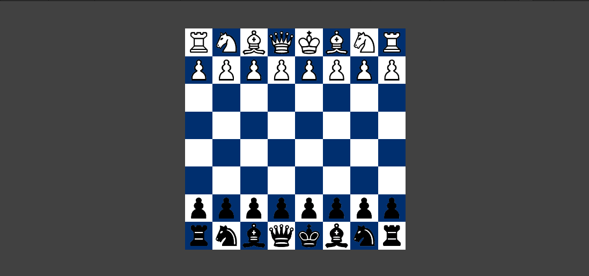
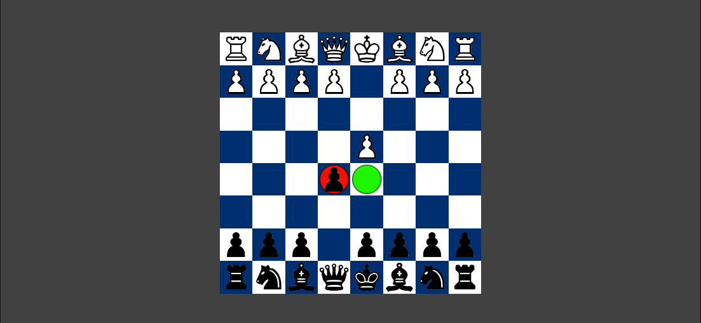
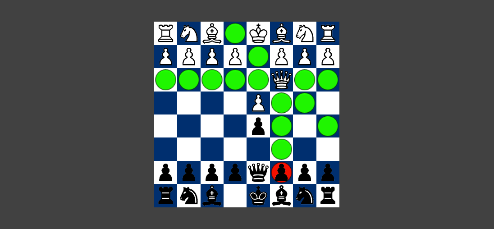

# ♟️ Chess Game

A clean and modular chess game built with Unity. This project demonstrates core chess mechanics like legal move calculation, turn-based logic, and capturing.



## 🧩 Features

- ✅ Interactive 8x8 chessboard  
- ♟️ Legal move calculation for all pieces  
- 🔄 Turn-based logic (White and Black)  
- ❌ Piece capturing  
- 🎯 Highlighting for selectable tiles and possible moves  

## 🚀 Getting Started

### Prerequisites

- Unity (2021.3 LTS or newer recommended)

### Installation

1. Clone the repository:
   ```bash
   git clone https://github.com/yourusername/chess.git
   ```

2. Open the project in Unity Hub.

3. Open the `Chess` scene and click **Play**.

## 📷 Screenshots

| Gameplay | Move Highlighting |
|----------|-------------------|
|  |  |

> Place your screenshots inside the `images/` folder in your repository.

## 🛠️ Planned Improvements

- ✅ Improve UI/UX for better experience  
- ⏱ Add timers and chess clocks  
- ♜ Check/checkmate/stalemate logic  
- 🧠 AI opponent  
- 🌐 Online multiplayer mode  


## 🙌 Contributing

Feel free to fork the repo, make changes, and submit a pull request. Contributions are welcome!

---

Made with ❤️ for chess lovers.
